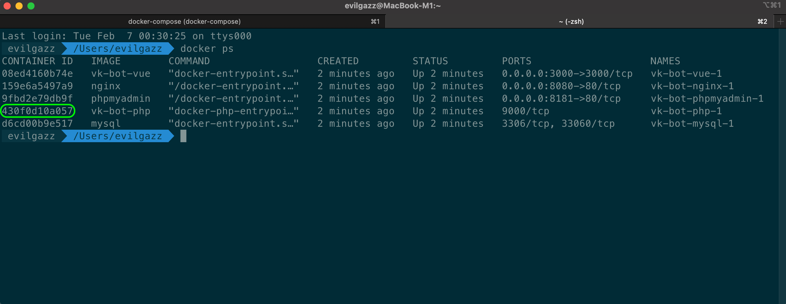

# vk-bot


## Документация
- **Основная документация**: https://olegopro.github.io/vk-bot/docs
- **API документация (Swagger)**: https://olegopro.github.io/vk-bot/swagger

## Использованные технологии

### Docker

Развертывание приложения базируется на использовании **Docker**, обеспечивая унифицированную и изолированную среду для каждого из его компонентов. Определение мультиконтейнерной архитектуры происходит через `docker-compose.yml`, включающий в себя сервисы:

-   `php` для бэкенда Laravel,
-   `nginx` как веб-сервер,
-   `vue` для фронтенда на Vue.js,
-   `mysql` как база данных,
-   `phpmyadmin` для управления базой данных.

Эта структура позволяет с легкостью управлять жизненным циклом сервисов приложения, включая их запуск, остановку и масштабирование.

#### Конфигурация сервисов:

-   **Бэкенд Laravel (`php`):** Из базового образа `php:8.3-fpm` создается контейнер, включающий все необходимые расширения PHP для работы Laravel, а также Composer для управления зависимостями.

-   **Фронтенд Vue.js (`vue`):** На основе образа `node:21-alpine` производится сборка и запуск проекта фронтенда с использованием `yarn`, поддерживая горячую перезагрузку для разработки.

-   **Nginx:** Веб-сервер настроен на обслуживание статических файлов фронтенда и проксирование запросов к бэкенду с помощью конфигурационных файлов из `./configs/nginx`.

-   **MySQL:** Контейнер базы данных инициализируется с заранее заданными настройками, упрощая процесс интеграции и использования в приложении.

-   **PhpMyAdmin:** Предоставляет графический интерфейс для управления MySQL, облегчая разработку и отладку базы данных.

Применение `docker-compose` и `Dockerfile` значительно облегчает процесс настройки разработческого окружения, делая его воспроизводимым и минимизируя потребность в ручной настройке.

### Laravel 10

Проект использует Laravel 10 для реализации RESTful API, демонстрируя глубокое понимание возможностей фреймворка и современных подходов к разработке веб-приложений. В проекте применяются команды Artisan, включая автоматическое расписание задач с помощью Scheduler и использование Job для обработки фоновых задач. Помимо миграций для создания структуры базы данных, есть возможность использовать Seeders для тестирования приложения.

Проект включает в себя разработку собственного фасада VkClient, предоставляющего удобный интерфейс для взаимодействия с VK API, и демонстрирует продвинутое использование сервисных слоев для разграничения бизнес-логики и взаимодействия с внешними API.

Контроллеры взаимодействуют с моделями через репозитории, следуя принципам SOLID и шаблону проектирования Repository, что облегчает поддержку кода. В проекте используются контроллеры для обработки HTTP-запросов, Eloquent ORM для работы с базой данных и Query Builder для более сложных запросов.

Для управления состоянием и организации логики выполнения задач на стороне сервера применяются сервисы, включая VkClientService, обеспечивающий интеграцию с социальной сетью ВКонтакте. Это позволяет эффективно управлять задачами по автоматизации действий в соцсети, например, автоматической публикации контента или сбора данных.

### Vue 3

В проекте VK-Bot активно используется Vue 3 с Composition API, что позволяет создавать легко поддерживаемые компоненты. Для управления состоянием приложения применяется Pinia.

Так же используются асинхронные функции и модальные окна Bootstrap для создания динамичного пользовательского интерфейса с поддержкой асинхронной загрузки данных.

Pinia используется для организации глобального состояния приложения, обеспечивая централизованное управление данными и их потоками. Это включает в себя асинхронную загрузку данных и хранение информации о состоянии интерфейса.

Проект активно взаимодействует с VK API для выполнения различных операций, таких как авторизация пользователей, получение данных аккаунтов и управление задачами на лайки.

## Используемые языки

PHP, JavaScript, SQL, HTML + SCSS

# Установка и запуск

Склонируйте репозиторий https://github.com/olegopro/vk-bot. Для этого откройте терминал, перейдите в папку где проектами и введите следующую команду для клонирования репозитория на локальный компьютер:

```bash
git clone https://github.com/olegopro/vk-bot
```

После этого перейдите в папку с проектом:

```bash
cd vk-bot/
```

Откройте папку в любом удобном редакторе кода (Sublime/VSCode/PHPStorm). В корне проекта найдите файл `docker-compose.yml`.

В разделе services→php→environment→`VK_API_SERVICE_KEY` вставьте cервисный ключ полученный после создания vk standalone-приложение (в интернете достаточно инструкций, как создать standalone-приложение).

Далее, для создания и запуска Docker контейнеров, основанных на конфигурации, определённой в файле docker-compose.yml, выполните следующую команду:

<details>
<summary>Команда docker-compose up --build</summary>

Эта команда используется для создания и запуска всех контейнеров, определенных в docker-compose.yml. Параметр --build указывает Docker на необходимость сначала построить образы для сервисов перед их запуском, что гарантирует использование самой последней версии вашего приложения и его зависимостей. Она идеально подходит для инициализации проекта, так как выполняет полную сборку среды разработки или продакшена.
</details>

```bash
docker-compose up --build
```

Эта команда выполнит несколько шагов: сборку образов, создание контейнеров и их запуск.

**Первый** контейнер - php с laravel 8. **Второй** контейнер - nginx. Он необходим для работы php. Так как мы работаем через php-fpm. **Третий** контейнер - vue. Если быть точным, то образ node для запуска Vue. **Четвёртый** контейнер - mysql. Пятый контейнер - phpMyAdmin.

После запуска будут доступны следующие адреса:

-   [localhost:8181](http://localhost:8181) - phpMyAdmin
-   [localhost:8080](http://localhost:8080) - Laravel (api)
-   [localhost:3000](http://localhost:3000) - Vue

Обратите внимание, что Vue сразу поддерживает hot reload сразу в контейнере.

Следующим этапом нужно создать таблицы в базе данных с помощью миграции в Laravel. Для этого нужно подключиться к контейнеру где запущен php. Сделать это можно следующей командой:

```bash
docker ps
```

Эта команда выведет запущенные docker контейнеры:


Теперь нужно попасть внутрь контейнера для запуска миграции. Для этого выполним следующую команду:

<details>
  <summary>Зачем использовать docker exec -it</summary>

Команда docker exec используется для выполнения команд внутри запущенного контейнера Docker. Опция -it позволяет подключиться к контейнеру интерактивно (-i для интерактивного режима и -t для терминала), что дает возможность вводить команды в shell контейнера. Это особенно полезно для управления приложениями внутри контейнера, выполнения скриптов, просмотра логов или исследования состояния приложения.

</details>

```bash
docker exec -it 430f0d10a057 bash
```

После ввода команды, попадаем в рабочую директорию контейнера `/var/www/html`

Первым делом создадим .env, точнее сделаем копию .env.example файла:

```bash
cp .env.example .env
```

Эта команда создаст новый файл .env с содержимым из .env.example

Следующий шаг это генерация ключа шифрования Laravel:

```bash
php artisan key:generate
```

Эта команда сгенерирует ключ и автоматически добавить его в новый файл .env.

Теперь очистим кэш конфигурации командой:

```bash
php artisan config:cache
```

Для того, что-бы в базе данных появились таблицы нужно выполнить миграцию Laravel с помощью artisan, выполним команду:

<details>
  <summary>Зачем нужно выполнить миграцию Laravel</summary>

Выполнение команды php artisan migrate:fresh в Laravel необходимо для инициализации структуры базы данных. Эта команда удаляет все существующие таблицы и заново выполняет все миграции, обеспечивая, таким образом, создание необходимых таблиц с правильной схемой. Это удобно для установки проекта с чистого листа или для сброса базы данных до начального состояния при разработке.

</details>

```bash
php artisan migrate:fresh
```

После выполнения этой команды талицы в базе данных `vk-bot` будут созданы.

Последний этап, это автоматический запуск новых задач. Для этого в этом же контейнере php запустим следующую команду:

<details>
  <summary>Для чего нужен символ &</summary>

Знак & в конце команды используется в Unix-подобных операционных системах для запуска процесса в фоновом режиме. Это позволяет вам продолжить использование терминала, не дожидаясь завершения работы команды. Когда вы добавляете & к команде php artisan queue:work, вы говорите операционной системе запустить обработчик очередей Laravel и не блокировать терминал для дальнейших вводов команд.

</details>

<details>
  <summary>Зачем запускать artisan queue:work</summary>
Команда php artisan queue:work используется для запуска обработчика очередей Laravel, который отвечает за выполнение заданий, помещенных в очереди. После запуска эта команда мониторит задания в очереди и выполняет их по мере их поступления. Это основной способ обработки фоновых задач в Laravel, позволяющий освободить основной поток выполнения от тяжелых задач, таких как отправка электронной почты, обработка изображений или пакетные вычисления.
</details>

```bash
php artisan queue:work &
```

Теперь можно полностью закрыть терминал.

Поздравляю! Теперь можно переходить по адресу [localhost:3000](localhost:3000) на frontend и добавлять vk аккаунт через **access token**.

Для получения токена нужно открыть в браузере следующую ссылку: [https://oauth.vk.com/authorize?client_id=**51533209**&display=page&redirect_uri=https://oauth.vk.com/blank.html&scope=friends,wall,offline&response_type=token&v=5.131](https://oauth.vk.com/authorize?client_id=51533209&display=page&redirect_uri=https://oauth.vk.com/blank.html&scope=friends,wall,offline&response_type=token&v=5.131),
где client_id, это id standalone-приложения.


После перехода по ссылке будет предложено ввести имя и пароль от аккаунта, далее будет следующее сообщение, о том, что приложение хочет получить доступ к данным.


В адресной строке получаем [https://oauth.vk.com/blank.html#access_token=](https://oauth.vk.com/blank.html#access_token=)**ТОКЕН**

Подробную информацию можно получить в [**документации**](https://dev.vk.com/api/access-token/implicit-flow-user) vkontakte.

P.S. Естественно данный способ добавления аккаунта является технический временным решением. Обычно для авторизации используется OAuth.
